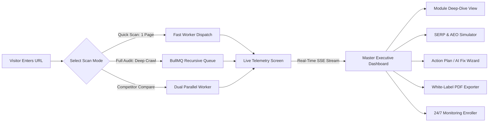
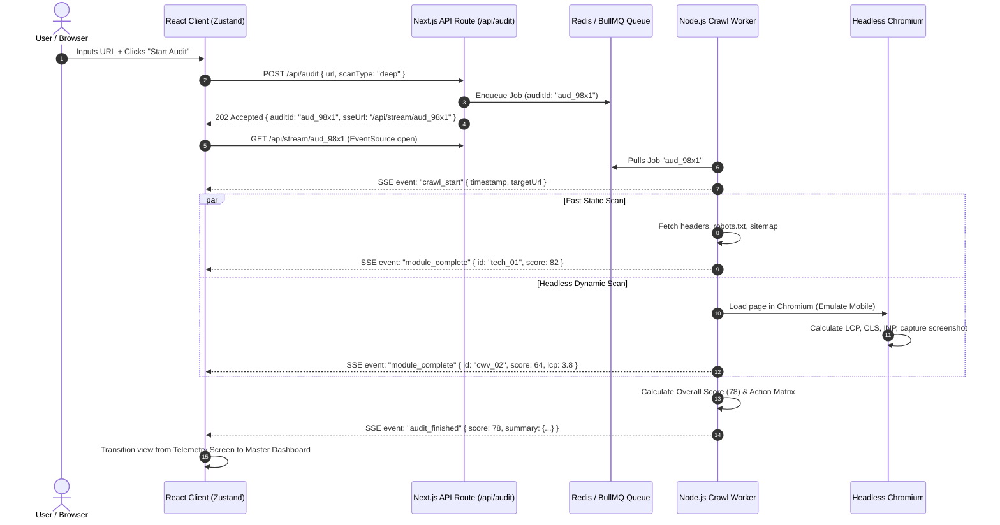

# Seo Overiter — UI Architecture & Live-State System Blueprint

> **File Objective**: Comprehensive visual layout, UI component hierarchy, and real-time live-state data flow specification for the **Seo Overiter** website auditing platform.

---

## Table of Contents
1. [System Architecture Overview](#1-system-architecture-overview)
2. [End-to-End User Flow & Navigation Map](#2-end-to-end-user-flow--navigation-map)
3. [UI Layouts & Screen Wireframes](#3-ui-layouts--screen-wireframes)
   - [View 1: Landing Page & Instant Audit Launchpad](#view-1-landing-page--instant-audit-launchpad)
   - [View 2: Live Streaming Progress & Telemetry Screen](#view-2-live-streaming-progress--telemetry-screen)
   - [View 3: Master Executive Dashboard (Health Score & Priority Matrix)](#view-3-master-executive-dashboard-health-score--priority-matrix)
   - [View 4: Module Deep-Dive Inspector (25 Auditing Modules)](#view-4-module-deep-dive-inspector-25-auditing-modules)
   - [View 5: Live SERP & AI Overview (AEO) Simulator](#view-5-live-serp--ai-overview-aeo-simulator)
   - [View 6: Competitor Head-to-Head Radar Comparison](#view-6-competitor-head-to-head-radar-comparison)
   - [View 7: 24/7 Real-Time Monitoring & Incident Feed](#view-7-247-real-time-monitoring--incident-feed)
   - [View 8: White-Label Report Generator & PDF Customizer](#view-8-white-label-report-generator--pdf-customizer)
4. [Live State Engine: Real-Time Data Pipeline](#4-live-state-engine-real-time-data-pipeline)
   - [The Real-Time Event Streaming Pipeline](#the-real-time-event-streaming-pipeline)
   - [Streaming Event Data Contract (SSE / WebSocket)](#streaming-event-data-contract-sse--websocket)
   - [Frontend State Management Lifecycle](#frontend-state-management-lifecycle)
   - [Error Resilience & Edge Case Handling](#error-resilience--edge-case-handling)
5. [Design System & UI Tokens](#5-design-system--ui-tokens)
6. [Component Hierarchy & Implementation Spec](#6-component-hierarchy--implementation-spec)

---

## 1. System Architecture Overview

Seo Overiter is built around a **dual-engine processing model** capable of delivering instant single-page analysis in under 5 seconds while concurrently streaming multi-page crawl telemetry to an interactive React dashboard:

```
┌────────────────────────────────────────────────────────────────────────────────────────┐
│                                 SEO OVERITER ECOSYSTEM                                 │
└────────────────────────────────────────────────────────────────────────────────────────┘
         │
         ├──► FRONTEND: Next.js 14 App Router, Vanilla CSS Modules, Zustand State, D3/SVG
         │
         ├──► REAL-TIME LAYER: Server-Sent Events (SSE) / WebSocket Gateway (Node.js)
         │
         ├──► WORKER QUEUE: Redis + BullMQ (Distributed job scheduling & concurrency)
         │
         ├──► ENGINE A (Fast Spider): Axios + Cheerio (Status codes, headers, raw HTML parse)
         │
         ├──► ENGINE B (Deep Renderer): Headless Chromium (Puppeteer/Playwright) for CWV & DOM
         │
         └──► PERSISTENCE: PostgreSQL (Audit history, team configs) + S3 (Cached screenshots)
```

---

## 2. End-to-End User Flow & Navigation Map



---

## 3. UI Layouts & Screen Wireframes

### View 1: Landing Page & Instant Audit Launchpad
*The high-converting entryway designed to hook users with zero onboarding friction.*

```
┌────────────────────────────────────────────────────────────────────────────────────────┐
│ 🟢 SEO OVERITER       [Features]  [25 Modules]  [Pricing]  [Docs]       [Login] [Start] │
├────────────────────────────────────────────────────────────────────────────────────────┤
│                                                                                        │
│                           DIAGNOSE. OPTIMIZE. OUTRANK.                                 │
│            The Enterprise SEO Auditor & AI Overview Readiness Platform                 │
│                                                                                        │
│   ┌────────────────────────────────────────────────────────────┬───────────────────┐   │
│   │ 🌐  https://example.com/                                   │   START AUDIT →   │   │
│   └────────────────────────────────────────────────────────────┴───────────────────┘   │
│                                                                                        │
│      (•) Single Page Quick Scan    ( ) Full Site Deep Crawl    ( ) Competitor Versus   │
│                                                                                        │
│   ⚡ Scanned in 4.2s   |   🛡️ 25 Audit Modules   |   🤖 AI Overview (AEO) Ready        │
│                                                                                        │
├────────────────────────────────────────────────────────────────────────────────────────┤
│  RECENT LIVE AUDITS (Live Marquee Ticker)                                              │
│  [ stripe.com: 94/100 🟢 ]   [ vercel.com: 91/100 🟢 ]   [ sluggishsite.org: 42/100 🔴 ]│
└────────────────────────────────────────────────────────────────────────────────────────┘
```

---

### View 2: Live Streaming Progress & Telemetry Screen
*The live state screen displayed while the crawler traverses the target URL. Users watch the audit execute live.*

```
┌────────────────────────────────────────────────────────────────────────────────────────┐
│ 🟢 SEO OVERITER    Auditing: https://example.com/                      [Cancel Audit]  │
├────────────────────────────────────────────────────────────────────────────────────────┤
│                                                                                        │
│  OVERALL PROGRESS: [ ████████████████████████░░░░░░░░░░░░ ] 64%  (ETA: 8s)              │
│  Discovered URLs: 142  |  Crawled: 91  |  Queue: 51  |  Active Concurrency: 8 workers   │
│                                                                                        │
├────────────────────────────────────────┬───────────────────────────────────────────────┤
│ LIVE MODULE STREAM (25 Modules)        │ REAL-TIME EVENT CONSOLE & EARLY FLAGS         │
├────────────────────────────────────────┼───────────────────────────────────────────────┤
│ [✓] 01. HTTP Status & Headers  (120ms) │ 14:02:11 [INFO] Googlebot User-Agent verified │
│ [✓] 02. Robots.txt & Canonicals(180ms) │ 14:02:12 [PASS] HTTPS SSL valid (89 days)     │
│ [⟳] 03. Core Web Vitals Render (2.1s)  │ 14:02:13 [WARN] High TTFB detected (840ms)   │
│ [⟳] 04. Heading & Semantic NLP (420ms) │ 14:02:14 [CRIT] 3 pages returning 404 dead   │
│ [ ] 05. Schema.org JSON-LD     (Queued)│ 14:02:15 [FOUND] Discovered /sitemap.xml      │
│ [ ] 06. E-E-A-T Trust Checker  (Queued)│                                               │
│ [ ] 07. Image Alt & CLS Sizing (Queued)│ ┌───────────────────────────────────────────┐ │
│ [ ] 08. SERP & AEO Preview     (Queued)│ │ ⚡ CURRENT RENDER SCREENSHOT (Chromium)    │ │
│ [ ] 09. Broken Link Radar      (Queued)│ │ [ Preview thumbnail updating live... ]    │ │
│ ... [16 more modules queued]           │ └───────────────────────────────────────────┘ │
└────────────────────────────────────────┴───────────────────────────────────────────────┘
```

---

### View 3: Master Executive Dashboard (Health Score & Priority Matrix)
*The primary command center presenting the aggregated SEO Health Score and 4-quadrant task board.*

```
┌────────────────────────────────────────────────────────────────────────────────────────┐
│ 🟢 SEO OVERITER  |  Target: https://example.com/  |  Last Crawl: Just now  [Re-Scan]  [PDF]│
├────────────────────────────────────────────────────────────────────────────────────────┤
│                                                                                        │
│  ┌──────────────────────┐  SCORE BREAKDOWN BY DIMENSION:                               │
│  │     SEO HEALTH       │  Technical Crawl    (30%)  ████████████████░░  82/100 🟢     │
│  │                      │  Core Web Vitals    (25%)  ████████████░░░░░░  64/100 🟡     │
│  │       78 / 100       │  On-Page & Semantic (20%)  ██████████████████  92/100 🟢     │
│  │        GRADE B       │  Content Quality    (15%)  ██████████████░░░░  71/100 🟡     │
│  │   "Good - 4 Critical"│  Security & Trust   (10%)  ██████████████████  95/100 🟢     │
│  └──────────────────────┘                                                              │
│                                                                                        │
├────────────────────────────────────────────────────────────────────────────────────────┤
│  PRIORITIZED IMPACT VS EFFORT ACTION MATRIX                                            │
├────────────────────────────────────────────────────────────────────────────────────────┤
│  ┌─────────────────────────────────────┬────────────────────────────────────────────┐  │
│  │ 🚀 QUADRANT 1: QUICK WINS           │ 🏗️ QUADRANT 2: MAJOR PROJECTS              │  │
│  │ (High Impact • Low Effort)          │ (High Impact • High Effort)                │  │
│  │ • Fix 4 canonical loop URLs [Fix]   │ • Compress hero media to WebP for LCP [Fix]│  │
│  │ • Add missing <title> on /checkout  │ • Re-architect internal linking depth > 4  │  │
│  ├─────────────────────────────────────┼────────────────────────────────────────────┤  │
│  │ ☕ QUADRANT 3: FILL-INS             │ ⏳ QUADRANT 4: LOW PRIORITY                │  │
│  │ (Low Impact • Low Effort)           │ (Low Impact • High Effort)                 │  │
│  │ • Add alt tag on 3 footer logos     │ • Remove unused legacy polyfill JS bundles │  │
│  └─────────────────────────────────────┴────────────────────────────────────────────┘  │
│                                                                                        │
├────────────────────────────────────────────────────────────────────────────────────────┤
│  25 AUDIT MODULE GRID (Click to expand deep-dive)                                      │
│  ┌──────────────┐ ┌──────────────┐ ┌──────────────┐ ┌──────────────┐ ┌──────────────┐  │
│  │ 01. Tech     │ │ 02. CWV      │ │ 03. Semantic │ │ 04. SERP/AEO │ │ 05. Schema   │  │
│  │ 82% 🟢 Pass  │ │ 64% 🟡 Warn  │ │ 92% 🟢 Pass  │ │ 70% 🟡 Warn  │ │ 100% 🟢 Pass │  │
│  └──────────────┘ └──────────────┘ └──────────────┘ └──────────────┘ └──────────────┘  │
│  ┌──────────────┐ ┌──────────────┐ ┌──────────────┐ ┌──────────────┐ ┌──────────────┐  │
│  │ 06. E-E-A-T  │ │ 07. Links    │ │ 08. Images   │ │ 09. Mobile   │ │ 10. Security │  │
│  │ 85% 🟢 Pass  │ │ 40% 🔴 Crit  │ │ 76% 🟡 Warn  │ │ 98% 🟢 Pass  │ │ 95% 🟢 Pass  │  │
│  └──────────────┘ └──────────────┘ └──────────────┘ └──────────────┘ └──────────────┘  │
│  [ Show Remaining 15 Modules ▼ ]                                                       │
└────────────────────────────────────────────────────────────────────────────────────────┘
```

---

### View 4: Module Deep-Dive Inspector (25 Auditing Modules)
*Triggered when a user clicks any module card on the dashboard.*

```
┌────────────────────────────────────────────────────────────────────────────────────────┐
│ ← Back to Dashboard   |   Module 02: Core Web Vitals & Performance Diagnostics         │
├────────────────────────────────────────────────────────────────────────────────────────┤
│                                                                                        │
│  SCORE: 64/100 🟡   |   Engine: Chromium Headless v126   |   Device: Moto G4 (Mobile)  │
│                                                                                        │
│  ┌───────────────────────────┬───────────────────────────┬──────────────────────────┐  │
│  │ LCP (Largest Contentful)  │ INP (Interaction to Next) │ CLS (Cumulative Layout)  │  │
│  │ 3.8s  🔴 Poor (Goal <2.5s)│ 142ms 🟢 Good (Goal <200ms)│ 0.04 🟢 Good (Goal <0.1) │  │
│  └───────────────────────────┴───────────────────────────┴──────────────────────────┘  │
│                                                                                        │
│  WATERFALL BOTTLENECK ANALYSIS:                                                        │
│  [TTFB: 420ms] ──► [FCP: 1.1s] ──────► [LCP: 3.8s (hero-banner.jpg - 2.8 MB)]        │
│                                                                                        │
│  DETECTED ISSUES & ONE-CLICK AI REMEDIATION CODE:                                      │
│  ┌──────────────────────────────────────────────────────────────────────────────────┐  │
│  │ 🔴 Issue: Unoptimized LCP Hero Image (hero-banner.jpg is 2,840 KB, non-preloaded) │  │
│  │                                                                                  │  │
│  │ 💡 Instant AI Fix:                                                               │  │
│  │ 1. Convert to AVIF/WebP (Expected reduction: 88% → 340 KB)                       │  │
│  │ 2. Add preload hint in HTML <head>:                                              │  │
│  │    ```html                                                                       │  │
│  │    <link rel="preload" as="image" href="/hero-banner.webp" type="image/webp">    │  │
│  │    ```                                                                           │  │
│  │    [Copy Code]  [Mark as Resolved]                                               │  │
│  └──────────────────────────────────────────────────────────────────────────────────┘  │
└────────────────────────────────────────────────────────────────────────────────────────┘
```

---

### View 5: Live SERP & AI Overview (AEO) Simulator
*Validates how the page is visually consumed by human searchers and cited by AI engines.*

```
┌────────────────────────────────────────────────────────────────────────────────────────┐
│ SERP & AI OVERVIEW (AEO) SIMULATOR                                                     │
├────────────────────────────────────────────────────────────────────────────────────────┤
│                                                                                        │
│  [ Google Desktop Preview ]    [ Google Mobile Preview ]    [ Gemini / AI Overview ]   │
│                                                                                        │
│  ┌──────────────────────────────────────────────────────────────────────────────────┐  │
│  │ 🤖 GOOGLE AI OVERVIEW READINESS SCORE: 88% 🟢                                    │  │
│  │                                                                                  │  │
│  │ ✨ Generative AI Answer Extract:                                                 │  │
│  │ "Seo Overiter is an automated website auditing platform that inspects Core Web   │  │
│  │ Vitals, indexability, and semantic entity architecture to rank sites in Top 3..."│  │
│  │                                                                                  │  │
│  │ 🔗 Cited Source Badge: [example.com/features] (92% Citation Confidence)          │  │
│  └──────────────────────────────────────────────────────────────────────────────────┘  │
│                                                                                        │
│  GOOGLE SEARCH ENGINE SNIPPET PREVIEW:                                                 │
│  ┌──────────────────────────────────────────────────────────────────────────────────┐  │
│  │ 🌐 https://example.com › blog › technical-seo-guide                               │  │
│  │ Technical SEO Audit Checklist (2026 Updated Guide) - Example                     │  │
│  │ Master every facet of technical SEO from crawl budgets to Core Web Vitals with   │  │
│  │ our 25-step audit checklist. Boost indexability and rank in Top 3.               │  │
│  └──────────────────────────────────────────────────────────────────────────────────┘  │
│  Title Pixel Width: 540px / 600px Max [OK 🟢]  |  Meta Desc: 148 / 160 chars [OK 🟢]   │
│                                                                                        │
└────────────────────────────────────────────────────────────────────────────────────────┘
```

---

### View 6: Competitor Head-to-Head Radar Comparison
*Side-by-side URL benchmarking.*

```
┌────────────────────────────────────────────────────────────────────────────────────────┐
│ COMPETITOR HEAD-TO-HEAD BATTLE                                                         │
├────────────────────────────────────────────────────────────────────────────────────────┤
│                                                                                        │
│  YOUR SITE: [ https://yoursite.com   ]  VS  COMPETITOR: [ https://competitor.com ]     │
│                                                                                        │
│  SPIDER RADAR BENCHMARK:                   SIDE-BY-SIDE METRICS:                       │
│              Technical (30%)               Metric            You        Competitor     │
│                    /\                      Health Score      78 🟡      89 🟢          │
│        Trust      /  \     Speed (CWV)     LCP Speed         3.8s 🔴    1.4s 🟢        │
│          /       / 🔵 \       \            Word Count        1,200      3,450 🟢       │
│         /       /______\       \           Schema Types      2          6 🟢           │
│        /        \ 🟠   /        \          Internal Links    14         82 🟢          │
│       AEO Ready  \    /    Content         Mobile Score      98 🟢      94 🟢          │
│                   \  /                                                                 │
│                 Backlinks                  🔵 Your Site    🟠 Competitor               │
│                                                                                        │
│  TOP MISSING SEMANTIC ENTITIES (Competitor has, you lack):                             │
│  [ "JSON-LD Breadcrumbs" ]   [ "INP optimization" ]   [ "Server Log Crawl Rate" ]     │
└────────────────────────────────────────────────────────────────────────────────────────┘
```

---

### View 7: 24/7 Real-Time Monitoring & Incident Feed
*Automated watcher for clients on retainers.*

```
┌────────────────────────────────────────────────────────────────────────────────────────┐
│ 24/7 SEO MONITORING RADAR                                        [+ Add Target Domain] │
├────────────────────────────────────────────────────────────────────────────────────────┤
│                                                                                        │
│  MONITORED DOMAINS (3 Active):                                                         │
│  • example.com         🟢 100% Uptime  |  Health: 78  |  Next Scan: in 24m             │
│  • shop-client.io      🔴 ALERT FIRED  |  Health: 54  |  Crawl Anomaly Detected        │
│  • saas-startup.co     🟢 Normal       |  Health: 92  |  Next Scan: in 3h              │
│                                                                                        │
│  LIVE INCIDENT TIMELINE:                                                               │
│  ┌──────────────────────────────────────────────────────────────────────────────────┐  │
│  │ 🔴 13:40 - shop-client.io: Accidental <meta name="robots" content="noindex">      │  │
│  │             detected on /product-catalog! Immediate alert dispatched to Slack.   │  │
│  │ 🟡 11:15 - example.com: LCP increased from 2.1s to 3.8s following release v2.4  │  │
│  │ 🟢 08:00 - Daily automated crawl cycle completed for 3 domains.                 │  │
│  └──────────────────────────────────────────────────────────────────────────────────┘  │
│                                                                                        │
│  ALERT INTEGRATIONS:  [✓] Slack Webhook   [✓] Discord Bot   [✓] Email Digest (Daily)   │
└────────────────────────────────────────────────────────────────────────────────────────┘
```

---

### View 8: White-Label Report Generator & PDF Customizer
*Enables agencies to export branded audits in seconds.*

```
┌────────────────────────────────────────────────────────────────────────────────────────┐
│ WHITE-LABEL AUDIT EXPORTER                                                             │
├────────────────────────────────────────────────────────────────────────────────────────┤
│  BRANDING CONTROLS:                   │  LIVE REPORT COVER PREVIEW:                    │
│                                       │  ┌──────────────────────────────────────────┐  │
│  Agency Name: [ Apex Digital Media ]  │  │   [ APEX DIGITAL MEDIA LOGO ]            │  │
│  Upload Logo: [ Browse: logo.svg   ]  │  │                                          │  │
│  Accent Color:[ #6366F1 (Indigo)   ]  │  │   EXECUTIVE WEBSITE AUDIT REPORT         │  │
│  Client Name: [ Acme Corp Global   ]  │  │   Prepared For: Acme Corp Global         │  │
│  Prepared By: [ Parth Sharma       ]  │  │   Domain: https://example.com            │  │
│                                       │  │   Date: September 24, 2026               │  │
│  INCLUDED SECTIONS:                   │  │                                          │  │
│  [✓] Executive Summary & Grade        │  │   OVERALL SEO HEALTH: 78 / 100           │  │
│  [✓] 4-Quadrant Priority Matrix       │  │   [ Radial Score Gauge Chart ]           │  │
│  [✓] Core Web Vitals Lab Data         │  │   "4 Critical Fixes Require Action"      │  │
│  [✓] Developer Code Fix Snippets      │  └──────────────────────────────────────────┘  │
│  [ ] Raw Crawl Data (Uncheck for exec)│                                                │
│                                       │  [📥 Download PDF]   [🔗 Generate Share Link]   │
└───────────────────────────────────────┴────────────────────────────────────────────────┘
```

---

## 4. Live State Engine: Real-Time Data Pipeline

### The Real-Time Event Streaming Pipeline



### Streaming Event Data Contract (SSE / WebSocket)

Every event sent from server to client follows this strict JSON schema:

```typescript
interface AuditStreamEvent {
  auditId: string;
  timestamp: number;
  type: 
    | "CRAWL_STARTED"
    | "URL_DISCOVERED"
    | "PAGE_CRAWLED"
    | "MODULE_PROGRESS"
    | "MODULE_COMPLETED"
    | "CRITICAL_ISSUE_FOUND"
    | "AUDIT_COMPLETED"
    | "AUDIT_FAILED";
  payload: {
    moduleId?: string;           // e.g. "cwv_diagnostics"
    moduleName?: string;         // e.g. "Core Web Vitals"
    status?: "running" | "pass" | "warn" | "crit";
    progressPercentage?: number; // 0 to 100
    moduleScore?: number;        // 0 to 100
    issue?: {
      severity: "critical" | "warning" | "info";
      title: string;
      url: string;
      codeSnippet?: string;
    };
    finalScore?: number;         // Delivered on AUDIT_COMPLETED
  };
}
```

### Frontend State Management Lifecycle

```
[Initial Idle State]
      │
      ▼  (User clicks "Start Audit")
[Pending Initialization]  ──► POST /api/audit dispatched
      │
      ▼  (SSE Connection Established)
[Streaming Active]
      ├── progressPercentage (0 -> 100%)
      ├── activeModuleList (updating pass/warn/crit badges in real time)
      ├── telemetryLog (live console messages)
      └── earlyCriticalFlags (toast alerts popping during crawl)
      │
      ▼  (Event: AUDIT_COMPLETED received)
[Hydrated Dashboard State]
      ├── masterScore (radial gauge animates to final number)
      ├── matrixQuadrants (Action Plan populated)
      └── moduleStore (25 module full data payloads ready for deep inspection)
```

### Error Resilience & Edge Case Handling
1. **Bot Blocking / Cloudflare 403**: Crawler detects WAF challenge, rotates to residential proxy pool with legitimate Chrome headers, or prompts user for basic auth bypass.
2. **Infinite Redirect Loops**: Spider limits max redirects to 5 hops; flags URL as `310 Redirect Loop Critical Failure`.
3. **Crawl Budget Overrun**: Deep crawl limits depth to 5 levels and max 500 URLs (configurable), prioritizing money pages and top sitemap entries.
4. **Network Dropouts**: Client SSE connection implements automatic exponential backoff reconnection (`retry: 2000`).

---

## 5. Design System & UI Tokens

To deliver a state-of-the-art developer tool aesthetic, the UI uses a **Dark Mode First** palette with vibrant neon accents and high-contrast status colors:

```css
:root {
  /* Surface Tokens */
  --bg-canvas: #090A0F;
  --bg-surface: #12141F;
  --bg-surface-elevated: #1B1E2E;
  --border-subtle: #262A3E;
  --border-highlight: #3B4263;

  /* Brand Accents */
  --brand-primary: #6366F1;     /* Vivid Indigo */
  --brand-cyan: #06B6D4;        /* Electric Cyan */
  --brand-glow: rgba(99, 102, 241, 0.25);

  /* Status Tokens */
  --status-pass: #10B981;       /* Emerald Green (Score 80-100) */
  --status-warn: #F59E0B;       /* Amber Orange (Score 50-79) */
  --status-crit: #EF4444;       /* Crimson Red (Score 0-49) */
  --status-info: #3B82F6;       /* Blue */

  /* Typography */
  --font-sans: 'Inter', -apple-system, BlinkMacSystemFont, sans-serif;
  --font-mono: 'JetBrains Mono', 'Fira Code', monospace;
}
```

---

## 6. Component Hierarchy & Implementation Spec

```
src/
├── app/
│   ├── page.tsx                    // View 1: Landing Page & Launchpad
│   ├── audit/
│   │   └── [auditId]/
│   │       ├── live/page.tsx       // View 2: Live Progress & Telemetry Screen
│   │       ├── dashboard/page.tsx  // View 3: Master Executive Dashboard
│   │       └── module/[modId]/     // View 4: Module Deep-Dive Inspector
│   ├── compare/page.tsx            // View 6: Competitor Head-to-Head
│   ├── monitor/page.tsx            // View 7: 24/7 Monitoring Feed
│   └── export/page.tsx             // View 8: White-Label Report Generator
├── components/
│   ├── ui/
│   │   ├── HealthGauge.tsx         // Animated SVG Radial Score
│   │   ├── ActionMatrix.tsx        // 4-Quadrant Impact vs Effort Board
│   │   ├── ModuleCard.tsx          // Summary card for each of 25 modules
│   │   ├── SerpSimulator.tsx       // Desktop/Mobile/AI Overview preview
│   │   ├── TelemetryConsole.tsx    // Real-time terminal log viewer
│   │   └── CodeFixSnippet.tsx      // Copy-paste developer fix block
│   └── layout/
│       ├── HeaderNav.tsx
│       └── Footer.tsx
├── lib/
│   ├── crawler/                    // Fast Cheerio + Puppeteer scrapers
│   ├── heuristics/                 // 25 Diagnostic rule evaluators
│   └── sse/                        // Server-Sent Events broker
└── store/
    └── useAuditStore.ts            // Zustand live state manager
```

---

*Authored for the Seo Overiter Project — Ready for Immediate Frontend & Backend Engineering Execution.*
