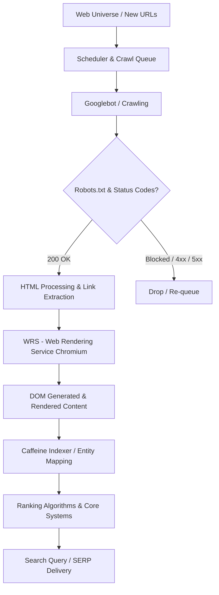
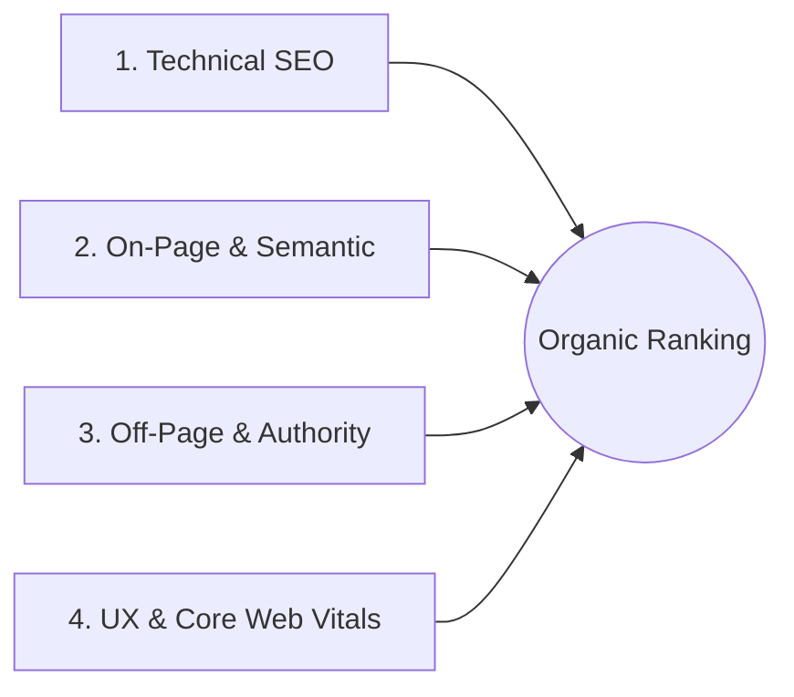
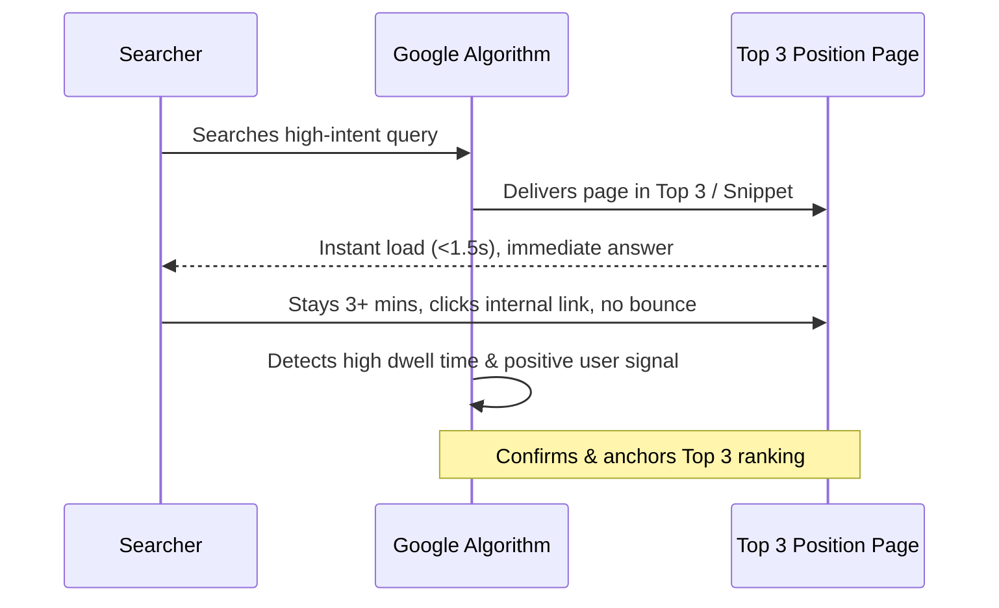

# Comprehensive SEO & Google Ranking Master Research Guide

> **Document Objective**: An end-to-end strategic and technical research document explaining how Google Search operates, how top competitors win search real estate, what modern SEO entails, and an actionable roadmap to rank in the coveted **Top 3 positions** on Google.

---

## Table of Contents
1. [Executive Summary: Modern Search Realities](#executive-summary-modern-search-realities)
2. [Part 1: How Google Search Works (Engine Architecture)](#part-1-how-google-search-works-engine-architecture)
   - [Crawling & Crawl Budget](#1-crawling--crawl-budget)
   - [Indexing & The Two-Wave Rendering Engine](#2-indexing--the-two-wave-rendering-engine)
   - [Serving, Evaluation & Modern Ranking Systems](#3-serving-evaluation--modern-ranking-systems)
   - [The E-E-A-T & Information Gain Framework](#4-the-e-e-a-t--information-gain-framework)
3. [Part 2: How Competitors Win & How to Reverse-Engineer Them](#part-2-how-competitors-win--how-to-reverse-engineer-them)
   - [Topical Authority & Content Footprint](#topical-authority--content-footprint)
   - [Backlink Equity & Anchor Distribution](#backlink-equity--anchor-distribution)
   - [Search Intent Gap Analysis Matrix](#search-intent-gap-analysis-matrix)
4. [Part 3: What SEO Is & The 4 Pillars of Search Dominance](#part-3-what-seo-is--the-4-pillars-of-search-dominance)
   - [Technical SEO Foundation](#pillar-1-technical-seo)
   - [On-Page & Semantic SEO](#pillar-2-on-page--semantic-seo)
   - [Off-Page Authority & Digital PR](#pillar-3-off-page-authority--digital-pr)
   - [User Experience & Search Signals (Core Web Vitals)](#pillar-4-user-experience--core-web-vitals)
5. [Part 4: The Strategy to Break into the Top 3 Positions](#part-4-the-strategy-to-break-into-the-top-3-positions)
   - [The CTR Cliff & Position Economics](#the-ctr-cliff--position-economics)
   - [Topical Clustering & Internal PageRank Sculpting](#topical-clustering--internal-pagerank-sculpting)
   - [Featured Snippets & AI Overview (AEO) Optimization](#featured-snippets--ai-overview-aeo-optimization)
6. [Part 5: Actionable Roadmap to Improve & Rank Your Website](#part-5-actionable-roadmap-to-improve--rank-your-website)
   - [Phase 1: Full-Stack Audit & Technical Hygiene](#phase-1-full-stack-audit--technical-hygiene-weeks-1-2)
   - [Phase 2: Intent-Driven Keyword & Topic Architecture](#phase-2-intent-driven-keyword--topic-architecture-weeks-3-4)
   - [Phase 3: High-Value Content Creation (10x Content)](#phase-3-high-value-content-creation-10x-content-weeks-5-8)
   - [Phase 4: Authority Building & Link Velocity](#phase-4-authority-building--link-velocity-weeks-9-12)
7. [Operational Checklist & KPIs to Track](#operational-checklist--kpis-to-track)

---

## Executive Summary: Modern Search Realities

Search Engine Optimization (SEO) in the modern era is no longer about keyword stuffing, exact-match domain tricks, or bulk low-quality link building. Google has evolved from a lexical matching engine (matching keywords in strings) into a **semantic, entity-driven understanding engine** powered by advanced machine learning models (RankBrain, BERT, MUM, Gemini).

To rank in the **Top 3**, a website must satisfy three fundamental pillars concurrently:
1. **Flawless Technical Accessibility**: Search engine bots must crawl, render, and index your content with near-zero friction.
2. **Unmatched Information Gain**: Content must deliver unique, authoritative insight that cannot be synthesized by scraping competing pages.
3. **Verified Entity Authority (E-E-A-T)**: Your domain, authors, and brand must be recognized as credible authorities within your specific topical niche.

```
       ┌────────────────────────────────────────────────────────┐
       │                 TOP 3 RANKING TRIANGLE                 │
       └────────────────────────────────────────────────────────┘
                                   ▲
                                  / \
                                 /   \
                                /  1  \
                               / Technical
                              / Foundation\
                             /             \
                            / 2           3 \
                           /Content &      Authority & \
                          /Semantic Depth  Digital Trust\
                         /───────────────────────────────\
```

---

## Part 1: How Google Search Works (Engine Architecture)

Google operates via three primary stages: **Crawling**, **Indexing**, and **Ranking/Serving**.



### 1. Crawling & Crawl Budget
- **Googlebot**: Automated crawler software (desktop and mobile user-agents; Google is **Mobile-First** by default).
- **Discovery**: Finds pages via `sitemap.xml`, internal links, inbound external links, and the Google Search Console (GSC) URL Inspection API.
- **Crawl Budget**: The finite number of URLs Googlebot can and wants to crawl on your site within a given timeframe. Crawl budget is determined by:
  - *Crawl Demand*: How popular or frequently updated your content is.
  - *Crawl Rate Limit*: How quickly your server responds without throwing 5xx errors or high latency.

### 2. Indexing & The Two-Wave Rendering Engine
Once raw HTML is downloaded, Google does not immediately consider it "indexed":
1. **Wave 1 (Initial HTML Parse)**: Googlebot reads static HTML and server-side markup. CSS and JavaScript may be deferred.
2. **Wave 2 (Web Rendering Service - WRS)**: Headless Chromium renders client-side JavaScript, executes DOM manipulation, and captures dynamically loaded elements.
3. **De-duplication & Canonicalization**: Google determines if the page is original or a duplicate of an existing URL using canonical tags, content fingerprinting, and URL parameters.
4. **Passage Ranking & Entity Dissection**: Content is parsed into contextual passages, semantic entities, and topical vectors stored in Google's **Caffeine** index.

### 3. Serving, Evaluation & Modern Ranking Systems
When a user enters a query, thousands of candidate documents are retrieved and evaluated in milliseconds through cascading algorithms:
- **RankBrain**: AI model that interprets queries, especially conversational or unprecedented queries, matching user intent rather than literal keywords.
- **BERT & MUM**: Transformer models that understand linguistic nuances, prepositions, sentiment, and cross-media context.
- **Helpful Content System (Core Algorithm Component)**: Sitewide classifier that penalizes sites producing content purely for search rankings rather than serving real human needs.
- **Freshness & QDF (Query Deserves Freshness)**: Detects whether a query requires breaking news, recent updates, or evergreen reference material.
- **SpamBrain**: Machine-learning system detecting manipulative link schemes, scraped content, and parasite SEO.

### 4. The E-E-A-T & Information Gain Framework

| Dimension | Meaning | How Google Evaluates It |
| :--- | :--- | :--- |
| **Experience** | First-hand, practical involvement | Original photography, proprietary screenshots, case studies, hands-on testing notes. |
| **Expertise** | Recognized skill or topical qualification | Author credentials, validated professional profiles, structured schema (`Person`, `author`). |
| **Authoritativeness** | Reputation as a go-to source | Inbound citations, brand searches, press mentions, links from high-authority industry peers. |
| **Trustworthiness** | Reliability, security, transparency | HTTPS, clear refund/editorial policies, business registration, accurate citations. |
| **Information Gain** | Novel value above existing SERP results | Unique data points, new statistics, contrarian analysis, proprietary templates, fresh experiments. |

---

## Part 2: How Competitors Win & How to Reverse-Engineer Them

Top competitors hold their positions not by luck, but by executing a systematic strategy across four vectors:

### Topical Authority & Content Footprint
Competitors dominating Page 1 rarely have just one good article on a topic. They own the entire **semantic field**.
- If ranking for "best email marketing tools", they also have comprehensive guides on:
  - *Email deliverability best practices*
  - *DKIM, SPF, DMARC setup*
  - *Automated welcome sequences*
  - *Individual tool comparison breakdowns*
- Google's algorithms detect this breadth and reward the entire domain with high topical authority scores.

### Backlink Equity & Anchor Distribution
Top competitors build and sustain link equity through:
1. **Digital PR**: Publishing original surveys, statistics, and industry benchmarks that journalists link to as sources.
2. **Natural Editorial Links**: Creating definitive resource guides that become industry standards.
3. **Anchor Text Balance**: Maintaining natural ratios:
   - *Branded & URL Anchors*: ~50% - 60%
   - *Topic & Partial Match Anchors*: ~25% - 30%
   - *Exact Match Anchors*: ~5% - 10% (avoiding Google Penguin penalties).

### Search Intent Gap Analysis Matrix
When analyzing any top-ranking competitor, complete this comparison matrix:

```
┌─────────────────────────────────┬──────────────────────────────────┬──────────────────────────────────┐
│ Competitor Strength             │ Why Google Rewards It            │ Our Counter-Strategy             │
├─────────────────────────────────┼──────────────────────────────────┼──────────────────────────────────┤
│ High Page Speed / 100% CWV      │ Zero user frustration, fast TTFB │ Modern CDN, server caching,      │
│                                 │                                  │ WebP/AVIF media, no JS bloat     │
├─────────────────────────────────┼──────────────────────────────────┼──────────────────────────────────┤
│ Exhaustive Answer Formats       │ Captures Featured Snippets       │ Clear H2/H3 question headers     │
│                                 │ and Quick Answers                │ with direct 45-word answers      │
├─────────────────────────────────┼──────────────────────────────────┼──────────────────────────────────┤
│ Proprietary Data / Calculators  │ High retention & natural links   │ Build interactive tools, free    │
│                                 │                                  │ templates, original research     │
├─────────────────────────────────┼──────────────────────────────────┼──────────────────────────────────┤
│ Author Credibility              │ High E-E-A-T score               │ Dedicated author bios, LinkedIn  │
│                                 │                                  │ verification, schema markup      │
└─────────────────────────────────┴──────────────────────────────────┴──────────────────────────────────┘
```

---

## Part 3: What SEO Is & The 4 Pillars of Search Dominance

SEO is the discipline of aligning your digital property's technical infrastructure, semantic content, and web-wide authority with search engine ranking criteria and human searcher intent.



### Pillar 1: Technical SEO
The non-negotiable foundation:
- **Clean Crawl Paths**: Logical internal links, no orphan pages, shallow architecture (every page reachable within 3 clicks from homepage).
- **XML Sitemaps**: Dynamic, error-free, segmented by page type, submitted to Google Search Console.
- **Robots.txt & Canonical Directives**: Proper indexing control; preventing duplicate content issues (`rel="canonical"`).
- **Schema.org Structured Data**: JSON-LD microdata enabling rich search results (Article, FAQPage, BreadcrumbList, Product, Organization, Person).
- **HTTP Status Code Management**: Proper 301 redirects (no redirect chains), clean 404/410 handling.

### Pillar 2: On-Page & Semantic SEO
Optimizing the contents of individual pages for machines and humans:
- **Search Intent Alignment**:
  - *Informational* ("how to calibrate a guitar")
  - *Commercial Investigation* ("best acoustic guitars under $1000")
  - *Transactional* ("buy Yamaha FG800 acoustic guitar")
  - *Navigational* ("Yamaha guitar customer support")
- **Semantic Keyword Modeling**: Using NLP entities and LSI terms (Latent Semantic Indexing) rather than repeating a single phrase.
- **Content Hierarchy**: Single `<h1>` tag matching query intent, structured `<h2>` and `<h3>` tags creating an intuitive outline.
- **Title Tag & Meta Description CTR Optimization**: Catchy, benefit-driven, containing primary keyword within first 60 characters without truncation.

### Pillar 3: Off-Page Authority & Digital PR
Establishing validation across the wider web:
- **Editorial Backlinks**: Mentions in authoritative publications, industry journals, podcasts, and reputable blogs.
- **Brand Signals**: Unlinked brand mentions, social proof, high branded search query volume in Google Trends.
- **Entity Association**: Consistent Name, Address, Phone (NAP) and verified profiles on Wikidata, Crunchbase, LinkedIn, and relevant industry directories.

### Pillar 4: User Experience & Core Web Vitals (CWV)
Google measures real-world user experience (Chrome User Experience Report - CrUX):
- **Largest Contentful Paint (LCP)**: Main content must render within **< 2.5 seconds**.
- **Interaction to Next Paint (INP)**: Page must react to user clicks and taps within **< 200 milliseconds**.
- **Cumulative Layout Shift (CLS)**: Unexpected layout shifts must score **< 0.1**.

---

## Part 4: The Strategy to Break into the Top 3 Positions

### The CTR Cliff & Position Economics
Why is "Top 3" the golden metric? The search landscape has a steep drop-off:

```
Organic Click-Through Rate (CTR) by Position:
Position 1:  ██████████████████████████████████  ~28% - 39%
Position 2:  ████████████████                   ~15% - 20%
Position 3:  █████████                          ~9% - 12%
Position 4:  █████                              ~6% - 8%
Position 5:  ████                               ~4% - 5%
Position 6-10: █                                 < 2% each
```

Moving from **Position 5 to Position 1** results in up to a **700% increase** in organic traffic for the same query.

### The Winning Playbook for Top 3 Ranking



#### 1. Topical Clustering & Internal PageRank Sculpting
Never publish disconnected, random blog posts. Implement the **Hub & Spoke** model:
- **Pillar Page (The Hub)**: A comprehensive guide covering the broad topic (e.g., "Complete Guide to Technical SEO").
- **Cluster Pages (The Spokes)**: 10–20 deep-dive articles on subtopics (e.g., "Canonical Tags Guide", "Core Web Vitals Optimization", "XML Sitemap Best Practices").
- **Hyperlinking Architecture**: Every cluster page links back to the pillar with descriptive anchor text, and the pillar links out to all clusters.

#### 2. Featured Snippet & AI Overview Stealing
To capture Position 0 / Featured Snippets:
- Target query formats starting with "What is", "How to", "Why does", or "Cost of".
- Place the exact target question as an `<h2>` or `<h3>` header.
- Provide a direct, concise **40 to 60-word answer** immediately below the header.
- Follow with a structured bulleted list, numbered step list, or HTML table.

#### 3. Information Gain Injection
Google's patent on "Information Gain Score" scores content higher if it offers unique insights not found in other indexed documents:
- Add a proprietary diagram or custom chart.
- Include a real data benchmark or survey finding from your own audience/platform.
- Provide a downloadable tool, calculator, or checklist.

---

## Part 5: Actionable Roadmap to Improve & Rank Your Website

### Phase 1: Full-Stack Audit & Technical Hygiene (Weeks 1-2)
1. **Google Search Console & Bing Webmaster Setup**:
   - Verify domain ownership via DNS TXT record.
   - Submit clean `sitemap.xml`.
   - Inspect coverage errors (crawl anomalies, 404s, redirected canonicals).
2. **Speed & Core Web Vitals Optimization**:
   - Host on modern cloud infrastructure with HTTP/3 support and Brotli compression.
   - Convert all images to WebP or AVIF formats; set explicit `width` and `height` attributes to eliminate CLS.
   - Defer non-critical JavaScript and inline critical CSS.
3. **Structured Data Implementation**:
   - Implement JSON-LD schema for Organization, WebSite, BreadcrumbList, and specific page types.

### Phase 2: Intent-Driven Keyword & Topic Architecture (Weeks 3-4)
1. **Keyword Research Triaging**:
   - Identify "Low-Hanging Fruit": Keywords with decent search volume (300 - 2,500/mo) and moderate competition.
   - Identify high-intent commercial terms with strong conversion probability.
2. **Map Content to Buying Funnel**:
   - *Top of Funnel (TOFU)*: High-volume educational guides (Builds brand awareness).
   - *Middle of Funnel (MOFU)*: Comparison guides, "X vs Y", case studies (Builds consideration).
   - *Bottom of Funnel (BOFU)*: Product pages, pricing breakdowns, free trial landing pages (Drives revenue).

### Phase 3: High-Value Content Creation (10x Content) (Weeks 5-8)
1. **The 10x Content Standard**:
   - Content must be 10 times better than whatever currently ranks in Position 1.
   - Clear visual design, custom infographics, no fluff, fast-reading typography.
2. **On-Page Optimization Checklist**:
   - [ ] Primary keyword in `<title>` (front-loaded)
   - [ ] Primary keyword in single `<h1>`
   - [ ] Primary keyword in first 100 words
   - [ ] Primary keyword in clean URL slug (e.g., `/topic-name/`)
   - [ ] Supporting LSI entities in `<h2>` and `<h3>` tags
   - [ ] Image `alt` text containing contextually relevant descriptions
   - [ ] Minimum of 3–5 contextual internal links to related content
   - [ ] Outbound links to 1–2 reputable, authoritative non-competing external sources

### Phase 4: Authority Building & Link Velocity (Weeks 9-12)
1. **Digital PR & Linkable Assets**:
   - Publish original data studies, state-of-the-industry reports, or interactive calculators.
   - Pitch journalists and trade publications looking for quotes and expert opinions (HARO, Connectively, Qwoted).
2. **Strategic Guest Contributions & Partnerships**:
   - Author authoritative guest essays on high-authority, closely-related industry publications.
3. **Broken Link & Unlinked Mention Reclaiming**:
   - Monitor web mentions of your brand name and request an active hyperlink.
   - Find relevant broken resources on competitors' sites and pitch your superior asset as a replacement.

---

## Operational Checklist & KPIs to Track

### Weekly & Monthly Health Checklist
- [ ] Monitor Google Search Console for crawl spikes, coverage issues, and indexation drop-offs.
- [ ] Track Core Web Vitals field data in PageSpeed Insights.
- [ ] Audit internal linking regularly to ensure new pages receive link equity from older high-authority pages.
- [ ] Refresh decaying content: identify pages dropping in clicks and update statistics, examples, and formatting.

### Key Performance Indicators (KPIs)
| KPI | Tool | Target |
| :--- | :--- | :--- |
| **Top 3 Keyword Count** | GSC / Ahrefs / SEMrush | Consistent month-over-month growth |
| **Organic Click-Through Rate (CTR)** | Google Search Console | > 20% for Position 1-3 branded/unbranded |
| **Core Web Vitals Pass Rate** | PageSpeed Insights / GSC | 100% of URLs in "Good" status |
| **Indexed Pages vs Submitted** | GSC Indexation Report | > 95% ratio |
| **Domain Topical Coverage** | Keyword Tracker / SERP Analysis | Visible rankings across all cluster nodes |

---

*Authored for the Seo Overiter Project — Ready for Immediate Implementation.*
