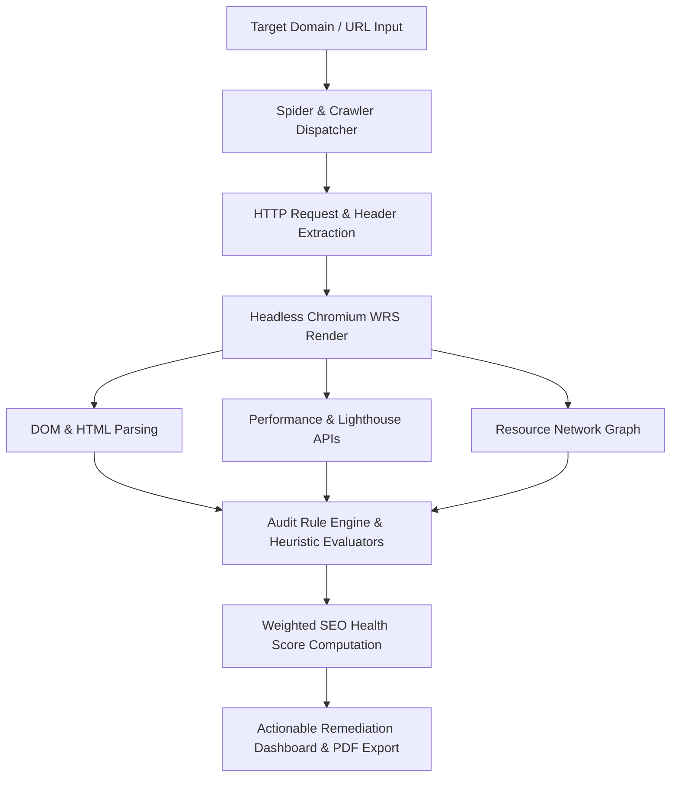

# Comprehensive Blueprint: SEO Website Auditor Tool, 25 Core Modules & Client Service Packages

> **File Objective**: Master research and product specification detailing how modern website auditing tools operate, the **25 Best Technical & AI Modules** for our proprietary **SEO Auditor Tool (Seo Overiter)**, and the complete suite of **Monetizable Done-For-You (DFY) Client Services**.

---

## Table of Contents
1. [What a Website Auditing Tool Does: Engine & Architecture](#1-what-a-website-auditing-tool-does-engine--architecture)
   - [How Automated Crawlers Work Under the Hood](#how-automated-crawlers-work-under-the-hood)
   - [Modern Audit vs Legacy SEO Checkers](#modern-audit-vs-legacy-seo-checkers)
2. [The 15 Core Technical & Content Services](#2-the-15-best-services-to-provide-in-our-seo-auditor-tool)
   - [Service 1: Deep Technical Crawl & Indexability Engine](#service-1-deep-technical-crawl--indexability-engine)
   - [Service 2: Core Web Vitals & Real-Time Performance Diagnostics](#service-2-core-web-vitals--real-time-performance-diagnostics)
   - [Service 3: Semantic On-Page & Heading Hierarchy Analyzer](#service-3-semantic-on-page--heading-hierarchy-analyzer)
   - [Service 4: SERP Preview, Snippet & AI Overview (AEO) Simulator](#service-4-serp-preview-snippet--ai-overview-aeo-simulator)
   - [Service 5: Content Quality & "Information Gain" Scorer](#service-5-content-quality--information-gain-scorer)
   - [Service 6: E-E-A-T & Trust Signals Verification](#service-6-e-e-a-t--trust-signals-verification)
   - [Service 7: Schema.org & JSON-LD Structured Data Inspector](#service-7-schemaorg--json-ld-structured-data-inspector)
   - [Service 8: Internal Linking & PageRank Flow Visualizer](#service-8-internal-linking--pagerank-flow-visualizer)
   - [Service 9: Image & Rich Media Optimization Engine](#service-9-image--rich-media-optimization-engine)
   - [Service 10: Mobile-First UX & Viewport Inspector](#service-10-mobile-first-ux--viewport-inspector)
   - [Service 11: Broken Link & Redirect Chain Radar](#service-11-broken-link--redirect-chain-radar)
   - [Service 12: Keyword Gap & Head-to-Head Competitor Comparison](#service-12-keyword-gap--head-to-head-competitor-comparison)
   - [Service 13: Security, SSL & Header Hygiene Inspector](#service-13-security-ssl--header-hygiene-inspector)
   - [Service 14: International SEO & Hreflang Auditor](#service-14-international-seo--hreflang-auditor)
   - [Service 15: AI-Driven "Impact vs Effort" Action Plan & White-Label Export](#service-15-ai-driven-impact-vs-effort-action-plan--white-label-export)
3. [System Architecture for Building Our Auditor](#3-system-architecture-for-building-our-auditor)
4. [Scoring Engine Methodology (The SEO Health Score)](#4-scoring-engine-methodology-the-seo-health-score)
5. [Implementation Roadmap (Phase 1 to Launch)](#5-implementation-roadmap-phase-1-to-launch)
6. [Additional Advanced Tool Services (Modules 16 to 25)](#6-additional-advanced-tool-services-modules-16-to-25)
   - [Service 16: Automated 24/7 SEO Monitoring & Critical Alert Radar](#service-16-automated-247-seo-monitoring--critical-alert-radar)
   - [Service 17: Server Log File Analysis (Googlebot Crawl Tracker)](#service-17-server-log-file-analysis-googlebot-crawl-tracker)
   - [Service 18: E-Commerce & Faceted Navigation SEO Auditor](#service-18-e-commerce--faceted-navigation-seo-auditor)
   - [Service 19: Local SEO & Google Business Profile (GBP) Diagnostic](#service-19-local-seo--google-business-profile-gbp-diagnostic)
   - [Service 20: Programmatic SEO & Scale-Template Quality Scanner](#service-20-programmatic-seo--scale-template-quality-scanner)
   - [Service 21: Real User Monitoring (RUM) Core Web Vitals Tracker](#service-21-real-user-monitoring-rum-core-web-vitals-tracker)
   - [Service 22: AI Search & LLM Citation Readiness Engine (GEO / AEO)](#service-22-ai-search--llm-citation-readiness-engine-geo--aeo)
   - [Service 23: Backlink Toxicity & Lost Link Radar](#service-23-backlink-toxicity--lost-link-radar)
   - [Service 24: Migration & Staging-to-Production Difference Auditor](#service-24-migration--staging-to-production-difference-auditor)
   - [Service 25: Built-in Generative AI One-Click Fix Assistant](#service-25-built-in-generative-ai-one-click-fix-assistant)
7. [Monetizable Services to Offer to Clients (Agency & DFY Offerings)](#7-monetizable-services-to-offer-to-clients-agency--done-for-you-offerings)
   - [Offering A: The "One-Time Technical SEO Overhaul" ($1,500 - $4,500)](#offering-a-the-one-time-technical-seo-overhaul-1500--4500)
   - [Offering B: Monthly SEO Growth Retainer ($1,500 - $5,000 / mo)](#offering-b-monthly-seo-growth-retainer-1500--5000--month)
   - [Offering C: Website Migration & Redesign SEO Protection ($2,000 - $6,500)](#offering-c-website-migration--redesign-seo-protection-2000--6500)
   - [Offering D: Google Penalty & Helpful Content Recovery Sprint ($2,500 - $7,500)](#offering-d-google-penalty--helpful-content-recovery-sprint-2500--7500)
   - [Offering E: White-Label Audit Platform for Agencies & Freelancers ($99 - $499 / mo)](#offering-e-white-label-audit-platform-for-agencies--freelancers-99--499--month)
   - [Offering F: Local SEO & Google Maps Domination Pack ($750 - $2,000 / mo)](#offering-f-local-seo--google-maps-domination-pack-750--2000--month)
8. [Client Packaging & Pricing Matrix](#8-client-packaging--pricing-matrix)

---

## 1. What a Website Auditing Tool Does: Engine & Architecture

A website auditing tool functions as an **emulated search engine crawler and technical inspection platform**. It mimics Googlebot by traversing web pages, evaluating static and dynamically rendered DOM structures, and identifying bottlenecks that prevent search engines from discovering, indexing, or ranking the website.



### How Automated Crawlers Work Under the Hood
1. **URL Discovery & Queue Management**: Starts at a seed URL, parses all internal `<a href="...">` links, canonical tags, and `sitemap.xml`, maintaining a visited set to avoid infinite loops.
2. **Dual-Phase Crawling**:
   - *Static HTML Fetch*: Fast regex/DOM parsing for HTTP headers, title, meta tags, and raw markup.
   - *Headless Browser Execution (Puppeteer/Playwright)*: Executes client-side JavaScript (React, Vue, Next.js), triggering DOM mutations and measuring visual metrics.
3. **Rule-Based Diagnostic Pipeline**: Compares extracted parameters against hundreds of SEO rules (status codes, canonical conflicts, word counts, layout shifts, schema validity).
4. **Actionable Synthesis**: Translates raw technical findings into developer-ready code fixes and executive business summaries.

### Modern Audit vs Legacy SEO Checkers
| Feature | Legacy 2015 SEO Checkers | Modern 2026 SEO Auditor (Seo Overiter) |
| :--- | :--- | :--- |
| **JS Rendering** | Plain cURL / raw HTML only | Full Headless Chromium hydration |
| **Metric Standard** | Basic page size & load seconds | Core Web Vitals (LCP, INP, CLS, TTFB) |
| **Search Paradigm** | Exact keyword density counts | Semantic entity modeling & NLP intent |
| **Modern AI Readiness** | Not supported | AI Overview (AEO) & Information Gain scoring |
| **Output Type** | Passive list of warnings | AI-generated code snippets & priority matrix |

---

## 2. The 15 Best Services to Provide in Our SEO Auditor Tool

Here are the 15 high-value services and modules designed for maximum market competitiveness and user value:

---

### Service 1: Deep Technical Crawl & Indexability Engine
*Ensures Google can effortlessly find, crawl, and store every critical page.*
- **What It Analyzes**:
  - HTTP Response codes (`200 OK`, `301/302 Redirects`, `404 Not Found`, `500 Server Errors`).
  - `robots.txt` compliance (disallowed paths, crawler directives, crawl-delay warnings).
  - Meta robots instructions (`noindex`, `nofollow`, `noarchive`, `nosnippet`).
  - Canonical tag integrity: self-referencing check, mismatch alerts, circular canonical loops.
  - XML Sitemap synchronization: discovers unlisted orphan pages and detects URLs in sitemaps that return non-200 status codes.
- **Deliverables**: Crawl Tree Map, Orphan Page Alert, Indexability Status Badge per URL.

---

### Service 2: Core Web Vitals & Real-Time Performance Diagnostics
*Diagnoses speed bottlenecks using Google's official ranking performance criteria.*
- **What It Analyzes**:
  - **LCP (Largest Contentful Paint)**: Detects the exact DOM node triggering LCP, image preload status, and render-delay duration (Target: `< 2.5s`).
  - **INP (Interaction to Next Paint)**: Measures JavaScript main-thread blocking, long tasks (`> 50ms`), and unoptimized event listeners (Target: `< 200ms`).
  - **CLS (Cumulative Layout Shift)**: Pinpoints unsized images, dynamically injected ads, or late-loading web fonts (Target: `< 0.1`).
  - **TTFB (Time to First Byte)**: Server response and DNS resolution speed (Target: `< 800ms`).
- **Deliverables**: Visual speed timeline, resource waterfall chart, specific recommendations for image compression, CSS inlining, and CDN caching.

---

### Service 3: Semantic On-Page & Heading Hierarchy Analyzer
*Validates document structure and semantic clarity for search engines and screen readers.*
- **What It Analyzes**:
  - Heading hierarchy validation: flags missing `<h1>`, multiple `<h1>` tags, or skipped heading levels (e.g., `<h1>` directly to `<h3>`).
  - Target keyword intent placement: verifies presence in title, meta description, H1, first 100 words, and URL slug.
  - Semantic entity density: uses NLP extraction to identify primary topical entities and compares them with top-ranking SERP benchmarks.
  - Title & Meta description length checker: flags truncation risks on desktop (580px / 60 chars) and mobile (960px / 155 chars).
- **Deliverables**: Heading visual outline tree, entity coverage score, snippet length safety indicators.

---

### Service 4: SERP Preview, Snippet & AI Overview (AEO) Simulator
*Simulates how the page appears in modern Google search results, social shares, and AI search interfaces.*
- **What It Analyzes**:
  - **Desktop & Mobile Google SERP Simulator**: Live interactive mockup rendering favicon, breadcrumbs, title tag, URL, and meta description.
  - **AI Overview (Answer Engine Optimization - AEO)**: Checks if the page features direct concise answers (40-60 words) under targeted question headers (`<h2>` "What is...", "How to...").
  - **Social Sharing Previews**: Validates Open Graph tags (`og:title`, `og:image`, `og:description`) and Twitter Card metadata.
- **Deliverables**: Pixel-accurate SERP preview card, AEO readiness score, Social snippet preview.

---

### Service 5: Content Quality & "Information Gain" Scorer
*Protects sites from the Google Helpful Content System penalties and flags low-value pages.*
- **What It Analyzes**:
  - Word count vs topic depth benchmark.
  - Thin content detection (< 300 words without transactional purpose).
  - Readability indices: Flesch-Kincaid Reading Ease and Grade Level.
  - Duplication & cannibalization scanner: calculates lexical similarity across pages on the same domain.
  - Information Gain signals: presence of original data, custom tables, case study citations, and media assets.
- **Deliverables**: Readability grade, thin content flag list, duplicate page matrix.

---

### Service 6: E-E-A-T & Trust Signals Verification
*Evaluates whether the site conveys Experience, Expertise, Authoritativeness, and Trustworthiness.*
- **What It Analyzes**:
  - Byline & Author profiles: detects author names, links to author bios, and associated schema.
  - Trust policy presence: scans for linked Privacy Policy, Terms of Service, About Us, and Contact pages in navigation/footer.
  - Secure communication: enforces HTTPS, valid SSL expiration, absence of mixed content (HTTP assets on HTTPS pages).
  - Editorial credibility: checks for citations, outbound reference links, and date published/modified metadata.
- **Deliverables**: E-E-A-T Compliance Checklist (Pass/Fail per criteria), Author trust badge.

---

### Service 7: Schema.org & JSON-LD Structured Data Inspector
*Unlocks rich search results (stars, recipes, FAQs, breadcrumbs) by validating microdata.*
- **What It Analyzes**:
  - JSON-LD, Microdata, and RDFa extraction.
  - Schema syntax validator: detects missing required fields and schema property type mismatches.
  - Eligible Rich Result preview: tests eligibility for FAQ, Review snippet, Article, HowTo, Product, and Organization snippets.
  - Auto-Generator Tool: generates error-free JSON-LD snippets ready to copy-paste.
- **Deliverables**: Schema hierarchy viewer, syntax error highlighter, instant schema code generator.

---

### Service 8: Internal Linking & PageRank Flow Visualizer
*Optimizes internal link architecture to distribute authority to money pages.*
- **What It Analyzes**:
  - Click depth: calculates how many clicks each URL is from the homepage (flags pages > 3 clicks deep).
  - Inbound vs outbound internal link counts per page.
  - Internal anchor text distribution: identifies generic anchor text (e.g., "click here", "read more") vs descriptive topical anchors.
  - Orphan page discovery: finds pages indexed or in sitemaps that have zero internal inbound links.
- **Deliverables**: Interactive Node-Link Graph visualization of site architecture, Click-Depth histogram.

---

### Service 9: Image & Rich Media Optimization Engine
*Identifies visual assets that degrade page speed and harm visual search indexing.*
- **What It Analyzes**:
  - Missing or empty `alt` text on informative images.
  - Image dimension attributes: identifies missing `width` and `height` properties causing CLS.
  - Legacy format detection: flags oversized PNGs and JPEGs that should be converted to modern WebP or AVIF.
  - Broken image links and slow-loading CDN external assets.
- **Deliverables**: Image audit inventory table with byte savings potential and missing alt text flags.

---

### Service 10: Mobile-First UX & Viewport Inspector
*Ensures flawless mobile usability matching Google's mobile-first indexing engine.*
- **What It Analyzes**:
  - Viewport meta tag configuration (`width=device-width, initial-scale=1.0`).
  - Tap target sizing: flags buttons and links placed too close together (< 48x48px spacing).
  - Mobile font legibility: checks for text elements with font size smaller than 12px.
  - Horizontal scroll anomalies: identifies fixed-width containers breaking mobile screen width.
- **Deliverables**: Mobile viewport rendering screenshot, tap target overlap warning map.

---

### Service 11: Broken Link & Redirect Chain Radar
*Eliminates link rot, preserving crawl equity and preventing user bounce rates.*
- **What It Analyzes**:
  - Internal broken links (404, 410) and broken external reference links.
  - Redirect chains and loops: flags multi-hop redirects (e.g., URL A -> URL B -> URL C) and infinite redirect loops.
  - Protocol consistency: flags internal links still pointing to old HTTP endpoints instead of HTTPS.
- **Deliverables**: Broken link resolution table showing source page, anchor text, and exact broken destination URL.

---

### Service 12: Keyword Gap & Head-to-Head Competitor Comparison
*Allows users to input competitor URLs and immediately see what they are missing.*
- **What It Analyzes**:
  - Side-by-side technical comparison (Performance, Schema, Word Count, Heading structure).
  - Keyword & Entity Gap: terms found in top 3 competitor pages missing from the user's page.
  - Content length and structural differences (competitor uses 5 tables and 3 videos vs your 0).
- **Deliverables**: Side-by-side radar chart, missing keyword list, competitor structure benchmark.

---

### Service 13: Security, SSL & Header Hygiene Inspector
*Checks technical headers that impact security, trust, and search engine crawling.*
- **What It Analyzes**:
  - Strict-Transport-Security (HSTS) implementation.
  - X-Content-Type-Options, X-Frame-Options, Content-Security-Policy (CSP) headers.
  - Mixed content scanner (insecure images, scripts, stylesheets loaded over HTTP).
  - Server banner disclosure (hiding server software versions from malicious actors).
- **Deliverables**: Security Header Grade (A+ to F), insecure asset list.

---

### Service 14: International SEO & Hreflang Auditor
*Prevents cross-language cannibalization for multi-country, multi-lingual businesses.*
- **What It Analyzes**:
  - `hreflang` tag syntax and valid ISO language/country code combinations.
  - Return tag reciprocity: ensures Page A pointing to Page B in German has a reciprocal tag on Page B pointing back to Page A.
  - Missing `x-default` fallback tag for unmatched regions.
- **Deliverables**: Hreflang verification matrix, missing return-tag alert list.

---

### Service 15: AI-Driven "Impact vs Effort" Action Plan & White-Label Export
*Converts complex audit data into an executive-ready task list with automated code fixes.*
- **What It Analyzes & Generates**:
  - **Impact vs Effort Matrix**: Classifies all detected issues into 4 quadrants:
    1. *Quick Wins* (High Impact, Low Effort - e.g., missing titles, broken canonicals).
    2. *Major Projects* (High Impact, High Effort - e.g., site re-architecture, full INP redesign).
    3. *Fill-ins* (Low Impact, Low Effort - e.g., minor alt text fixes).
    4. *Low Priority* (Low Impact, High Effort).
  - **Copy-Paste Developer Fixes**: Code snippets for `.htaccess`, `nginx.conf`, robots.txt, and HTML head blocks.
  - **White-Label Branded PDF Reports**: Customizable with agency logos, custom color schemes, and client notes.
- **Deliverables**: Interactive prioritized task board, one-click PDF/CSV export.

---

## 3. System Architecture for Building Our Auditor

```
┌─────────────────────────────────────────────────────────────────────────────┐
│                            FRONTEND (WEB APP)                               │
│  - Interactive Dashboard, Score Gauges, Crawl Tree Visualizer, PDF Exporter │
└──────────────────────────────────────┬──────────────────────────────────────┘
                                       │ REST / WebSocket
┌──────────────────────────────────────▼──────────────────────────────────────┐
│                            API & ORCHESTRATION                              │
│  - Job Dispatcher, Authentication, Domain Quotas, Webhook Notifications     │
└──────────────┬───────────────────────────────────────────────┬──────────────┘
               │                                               │
┌──────────────▼──────────────┐                ┌───────────────▼──────────────┐
│      FAST STATIC CRAWLER    │                │      HEADLESS BROWSER        │
│  - Cheerio / Got / Axios    │                │  - Puppeteer / Playwright    │
│  - Status codes, HTML parse │                │  - JS DOM hydration, CWV,    │
│  - Header inspection        │                │    Screenshots, Layout shift │
└──────────────┬──────────────┘                └───────────────┬──────────────┘
               │                                               │
               └───────────────────────┬───────────────────────┘
                                       │
┌──────────────────────────────────────▼──────────────────────────────────────┐
│                          HEURISTIC & AI ANALYSIS                            │
│  - Entity Extraction, Duplicate Detection, Schema Validator, Scoring Engine │
└──────────────────────────────────────┬──────────────────────────────────────┘
                                       │
┌──────────────────────────────────────▼──────────────────────────────────────┐
│                        STORAGE & REPORT GENERATOR                           │
│  - PostgreSQL (Results), Redis (Job Queue), PDF Rendering Engine (Puppeteer)│
└─────────────────────────────────────────────────────────────────────────────┘
```

---

## 4. Scoring Engine Methodology (The SEO Health Score)

Our tool calculates a unified **SEO Health Score (0 - 100)** weighted across 5 critical dimensions:

$$Score = (Tech \times 0.30) + (CWV \times 0.25) + (OnPage \times 0.20) + (Content \times 0.15) + (Security \times 0.10)$$

| Dimension | Weight | Critical Failure Conditions |
| :--- | :--- | :--- |
| **Technical & Indexability** | 30% | 4xx/5xx status codes, `noindex` on money pages, broken canonical tags. |
| **Core Web Vitals & Speed** | 25% | LCP > 4.0s, CLS > 0.25, unoptimized multi-megabyte payloads. |
| **On-Page & Structure** | 20% | Missing title tag, missing H1, unoptimized meta descriptions. |
| **Content & Information Gain** | 15% | Thin content (<200 words), heavy internal duplication, poor readability. |
| **Security & Trust** | 10% | Missing SSL, mixed HTTP content, missing trust policies. |

---

## 5. Implementation Roadmap (Phase 1 to Launch)

```
[Phase 1: Core Engine] ───> [Phase 2: Modern Diagnostics] ───> [Phase 3: Intelligence & Polish]
• URL Parser & Crawler       • Core Web Vitals Engine          • AI Impact vs Effort Matrix
• Static HTML Auditor        • Headless Chrome JS Renderer     • Competitor Head-to-Head
• Status & Canonical Rules   • Schema.org JSON-LD Validator    • White-Label PDF Engine
```

1. **Sprint 1 (Weeks 1–2)**: Build single-URL fast scanner (Status codes, headers, Title/Meta, Headings, Image Alt tags).
2. **Sprint 2 (Weeks 3–4)**: Implement Headless browser integration for Core Web Vitals (LCP, CLS, INP) and client-side rendered DOM extraction.
3. **Sprint 3 (Weeks 5–6)**: Add Multi-page recursive crawler with click-depth calculation and internal link graph builder.
4. **Sprint 4 (Weeks 7–8)**: Build the 15th module (AI-powered "Impact vs Effort" action plan) and high-converting white-label PDF export.

---

## 6. Additional Advanced Tool Services (Modules 16 to 25)

Beyond the initial 15 services, these 10 advanced modules position our platform as an enterprise-grade powerhouse:

### Service 16: Automated 24/7 SEO Monitoring & Critical Alert Radar
- **What It Does**: Silently monitors pages daily/hourly for catastrophic changes that cause instant ranking drops.
- **Alert Triggers**: Accidental injection of `noindex` or `disallow /`, deleted canonical tags, altered title tags, sudden drop in word count, or site-wide 500 errors.
- **Delivery Channels**: Real-time alerts via Email, Slack, Discord, and Webhooks.

### Service 17: Server Log File Analysis (Googlebot Crawl Tracker)
- **What It Does**: Ingests server access logs (Nginx, Apache, Cloudflare) to unveil real bot behavior.
- **Key Insights**: Identifies which URLs Googlebot crawls daily vs which it ignores; reveals crawl budget wasted on non-indexable, parameterized, or redirecting URLs.

### Service 18: E-Commerce & Faceted Navigation SEO Auditor
- **What It Does**: Specialized audits tailored for online stores (Shopify, WooCommerce, Magento).
- **Key Checks**: Faceted navigation parameter bloat (filters for size, color, price creating infinite duplicate URLs), out-of-stock product handling (404 vs 301 vs backorder schema), and Product & Review schema completeness.

### Service 19: Local SEO & Google Business Profile (GBP) Diagnostic
- **What It Does**: Audits local search presence for brick-and-mortar and service-area businesses.
- **Key Checks**: NAP (Name, Address, Phone) consistency across major directories, LocalBusiness JSON-LD markup with geo-coordinates, Google Maps embed validation, and local landing page relevancy.

### Service 20: Programmatic SEO & Scale-Template Quality Scanner
- **What It Does**: Tests thousands of programmatically generated pages (e.g., "Best plumbers in [City]").
- **Key Checks**: Detects algorithmic boilerplate penalties, calculates unique-to-duplicate content ratios, and flags near-identical doorway pages.

### Service 21: Real User Monitoring (RUM) Core Web Vitals Tracker
- **What It Does**: Provides a lightweight 1KB JS snippet clients embed on their site.
- **Key Checks**: Captures actual field user Core Web Vitals (INP, LCP, CLS) from live visitors, segmented by country, network speed, and mobile device type.

### Service 22: AI Search & LLM Citation Readiness Engine (GEO / AEO)
- **What It Does**: Evaluates how likely AI engines (ChatGPT Search, Perplexity, Google Gemini, Claude) are to cite the client's page as an authoritative source.
- **Key Checks**: Direct answer blocks, entity clarity, table/list data formatting, citation-rich references, and factual density.

### Service 23: Backlink Toxicity & Lost Link Radar
- **What It Does**: Continuously audits inbound backlinks for sudden spikes in spam or lost high-equity links.
- **Key Checks**: Identifies toxic anchor text manipulation (gambling/pharma injection), generates ready-to-upload Google Disavow text files, and flags when top editorial links break.

### Service 24: Migration & Staging-to-Production Difference Auditor
- **What It Does**: Compares a development/staging site against the live production site prior to launch.
- **Key Checks**: Verifies 1-to-1 301 redirect mappings, flags missing meta tags or content changes between old and new URLs, and ensures staging `noindex` directives are stripped before production launch.

### Service 25: Built-in Generative AI One-Click Fix Assistant
- **What It Does**: Uses LLM intelligence to not just diagnose issues, but actively write the solutions.
- **Key Outputs**: Generates rewritten, high-CTR Title tags and Meta descriptions within character limits; rewrites weak introduction paragraphs; generates full JSON-LD schema blocks ready to copy-paste.

---

## 7. Monetizable Services to Offer to Clients (Agency & Done-For-You Offerings)

You can package this technology into high-ticket **Done-For-You (DFY)** and **Productized Consulting Services** that clients gladly pay for:

```
┌─────────────────────────────────────────────────────────────────────────────┐
│                       COMMERCIAL SERVICES LADDER                            │
├─────────────────────────────────────────────────────────────────────────────┤
│ Level 4: Enterprise Retainer ($3,500 - $7,000/mo)                           │
│   Full growth management, weekly audits, content engineering, link PR       │
├─────────────────────────────────────────────────────────────────────────────┤
│ Level 3: Done-For-You Technical Fix Sprint ($2,000 - $5,000 one-off)        │
│   Hands-on remediation: We fix CWV, schema, redirects, and crawl issues     │
├─────────────────────────────────────────────────────────────────────────────┤
│ Level 2: Comprehensive In-Depth Audit & Action Roadmap ($750 - $1,800)      │
│   Complete white-label PDF audit, video walkthrough, prioritized backlog    │
├─────────────────────────────────────────────────────────────────────────────┤
│ Level 1: Automated Self-Serve Audit / Lead Magnet ($0 - $99)                │
│   Instant score report, high-level summary used to generate qualified leads │
└─────────────────────────────────────────────────────────────────────────────┘
```

### Offering A: The "One-Time Technical SEO Overhaul" ($1,500 – $4,500)
- **Who It's For**: Businesses with stagnant traffic, poor page speed, or recent drops in rankings.
- **What You Deliver**:
  1. Full site crawl using our tool with all 15 core modules.
  2. Complete Core Web Vitals optimization (passing LCP, CLS, INP).
  3. Direct implementation of missing Schema.org structured data.
  4. Fix all broken links (404s), redirect chains, and canonical mismatches.
  5. 60-minute Loom video walking the client's leadership through the fixes.

### Offering B: Monthly SEO Growth Retainer ($1,500 – $5,000 / month)
- **Who It's For**: E-commerce stores, SaaS companies, and high-ticket service providers.
- **What You Deliver**:
  1. Continuous 24/7 technical monitoring (instant alerts on indexation drops).
  2. Monthly technical crawl and health score report.
  3. Publishing & optimizing 4–8 cluster articles mapped to high-intent keywords.
  4. Internal linking audits and monthly content refreshes for decaying pages.
  5. Executive KPI dashboard showing ranking trajectory and organic revenue.

### Offering C: Website Migration & Redesign SEO Protection ($2,000 – $6,500)
- **Who It's For**: Companies moving from WordPress to Shopify, Webflow, or custom React/Next.js stacks.
- **What You Deliver**:
  1. Pre-launch staging site audit using our tool.
  2. 100% complete 301 redirect map preventing any traffic loss.
  3. Post-launch live monitoring during the critical 72-hour window.
  4. Search Console indexation tracking and quick resolution of crawl anomalies.

### Offering D: Google Penalty & Helpful Content Recovery Sprint ($2,500 – $7,500)
- **Who It's For**: Sites hit by Google Core Updates or Helpful Content System classifiers.
- **What You Deliver**:
  1. Full content inventory audit: classifying every page into *Keep*, *Prune (410/noindex)*, or *Consolidate (301)*.
  2. Identification of AI-thin pages, unhelpful templates, and keyword stuffing.
  3. Addition of first-party E-E-A-T elements, author credentials, and original data assets.
  4. Resubmission strategy and tracking until traffic rebounds.

### Offering E: White-Label Audit Platform for Agencies & Freelancers ($99 – $499 / month)
- **Who It's For**: Marketing agencies, web designers, and freelance SEO consultants.
- **What You Deliver**:
  1. Access to our auditing tool branded with their agency logo, colors, and domain.
  2. Embeddable lead generation audit widget they can put on their own website to capture client emails.
  3. Instant 1-click export of unbranded or custom-branded client reports.

### Offering F: Local SEO & Google Maps Domination Pack ($750 – $2,000 / month)
- **Who It's For**: Dentists, lawyers, roofers, local contractors, and retail chains.
- **What You Deliver**:
  1. Full local audit (NAP consistency, LocalBusiness schema, GBP completeness).
  2. Geo-targeted landing page creation and local cluster linking.
  3. Local citation building across top directories (Yelp, YellowPages, local chambers).
  4. Google Business Profile optimization and weekly post scheduling.

---

## 8. Client Packaging & Pricing Matrix

| Tier | Service Package | Price Point | Deliverables | Target Client |
| :--- | :--- | :--- | :--- | :--- |
| **Starter** | Quick Audit & Action Checklist | **$299 - $500** | Full crawl report, top 10 quick fixes, PDF export | Small local businesses, solo bloggers |
| **Professional** | Full Technical & Speed Overhaul | **$1,500 - $3,500** | Complete hands-on technical fix, Core Web Vitals, Schema | Mid-market businesses, eCommerce |
| **Enterprise** | Migration / Redesign Protection | **$2,500 - $6,000** | Pre/post migration audits, redirect mapping, launch QA | Rebranding brands, CMS migrators |
| **Retainer** | Dedicated SEO Growth Partner | **$2,000 - $5,000/mo** | Ongoing monitoring, content clusters, technical upkeep | Funded SaaS, high-growth eCommerce |
| **SaaS Model** | White-Label Agency Tool Access | **$149 - $499/mo** | Unlimited white-label audits, lead-gen embed widget | Marketing agencies, web design shops |

---

*Authored for the Seo Overiter Project — Ready for Immediate Commercialization & Execution.*

